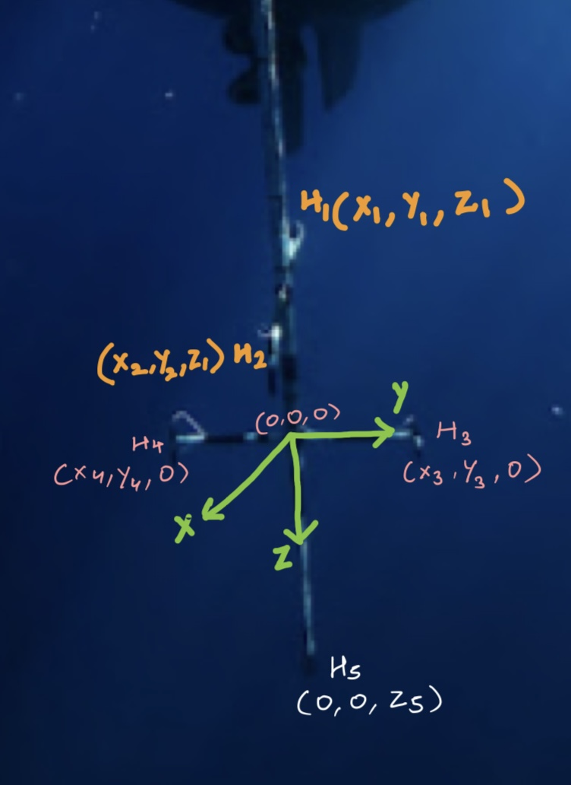
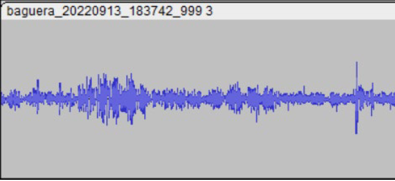
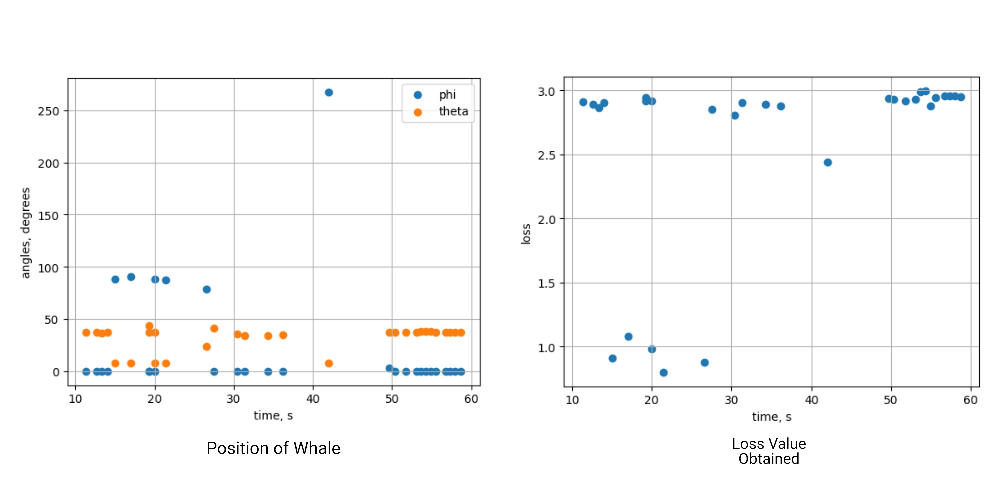
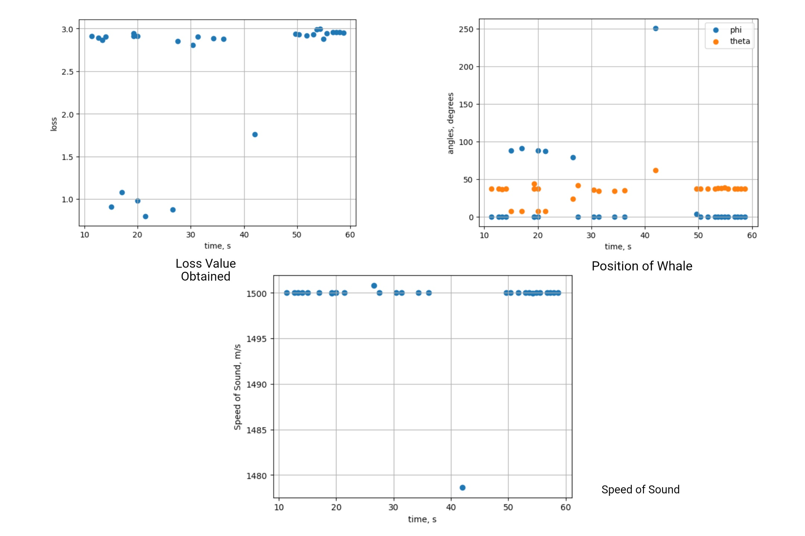
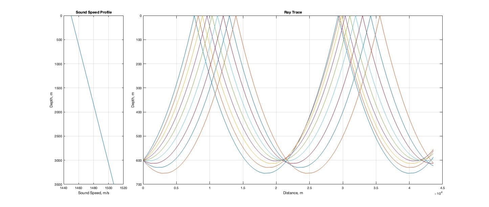
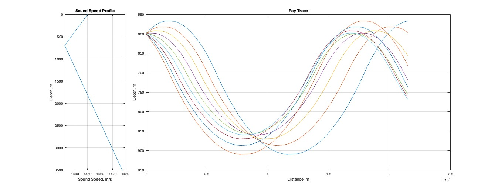
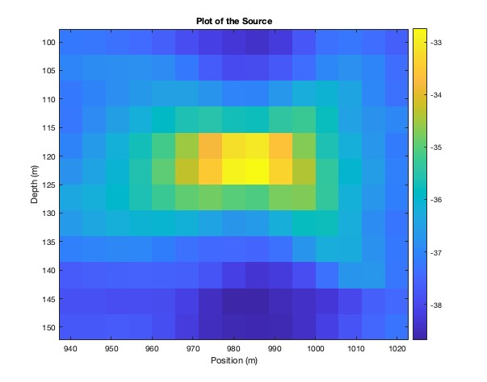

# Underwater_and_Bio_Acoustics
## Objectives: 
The aim of this course is to give the students understanding of both Physics of acoustic waves and signal processing techniques, in order to be able to suggest which system is appropriate for given specifications, to predict its performances through simple models, to implement data processing algorithms and to interpret the results. The complementarity of deep learning techniques with physics based approach is highlighted.Contents:- Propagation of acoustic waves in shallow and deep water, scattering, Doppler effect.- Signal processing: positioning, detection and ranging, noise correlation, time reversal.

## Instructors:

* [Marc Saillard](https://www.mio.osupytheas.fr/fr/marc-saillard)
* [Herve Glotin](https://glotin.univ-tln.fr/)

## Bio Aoustics Project: Whale Position Estimation

Determining the (x, y, z) coordinates and arrival times (t) of the 30 most prominent whale clicks (highest signal-to-noise ratio) detected in a given recorded audio file.

Two Solution Approaches are taken into consideration:

1. Fixed Sound Speed (1490 m/s)
2. Estimated Sound Speed

Hydrophone Arrangement

### Datasets

Raw audio signal

Average time delay:
|Hydrophones|Delay (in Seconds)|
|------|----------|
| dt12 | 32.03333 |
| dt34 | -5.2     |
| dt51 | -5.03333 |
| dt52 | -36.1667 |
| dt53 | -14.2333 |
| dt54 | -10.2    |

Positioning of the hydrophones, as determined in the earlier analysis, is described as follows, with coordinates specified in meters:

- H1: 54.78, 0.31, -70.07
- H2: -53.71, 2.06, -70.07
- H3: 1.10, 54.36, 0.00
- H4: 2.82, -53.13, 0.00
- H5: 0.00, 0.00, 113.11

### Results

Results with fixed speed of sound

Results with estimated speed of sound}

## Underwater Acoustics Assignment 1: Underwater Wave Propagation

**Arctic Ocean**

The simplest model for the velocity profile in this ocean is an affine function of depth :
$$c(z) - c_0 + \gamma_0 z$$
where $c_0 = 1450 ms^{-1}$ and $\gamma_0 = 1.63 x 10^{-2} s^{-1}$ with seafloor at depth $h = 3.50 km$.

Let us consider a sonar placed at the depth $z_s = 600 m$, emitting a beam of angular width $4°$
around the horizontal direction (from $-2°$ to $+2°$ as measured from horizontal axis). With the
help of the software, plot the trajectory of the rays constituting the beam over a period of $30s$. 

Plot of Propogation: Arctic

**Mediterranean Sea**

Because of the higher water temperature at the surface, we observe a decrease of the sound
velocity over $700$ m, with $-0.026 s^{-1}$ gradient($\gamma$), before returning to a pressure-driven behaviour, as described above for the Arctic Ocean $(\gamma_0 = +1.63 x 10^{-2} s{-1})$.

Plot the trajectory of the rays constituting the beam over a period of $15s$. The transmitter remains the same and is still located at $600m$ depth.   

Plot of Propogation: Mediterranean

More Questions and solutions releted to this assignment can be found in `/Assignment 1`

## Underwater Acoustics Assignment 2: Inverse Source Problem

The main idea of the assessment is to find the depth of the water column and depth of the source. A file containing the signals received by 9 receivers from the source has been used. The source can be found by sending back the signals received from the receivers and plotting an energy map to discover the energy concentration, which gives us the location of the source(transmitter). MATLAB software has been used and the code has been attached to this file for reference.
\begin{Problem}
Let us consider a water channel, $h$m in depth, and let us assume that the velocity $c$ is constant and
equal to $1500 m/s$. A signal is transmitted from a point-like source in the water and measured by a set of 9 receivers located along a vertical line at depths $25*n$ meters, $1 ≤ n ≤ 9$. When hitting the
(flat) boundaries, the acoustic waves are totally reflected.

The file ‘Received.mat’ contains a $9 x 32000$ array which provides the 9 received signals during
$6.4$ s with sampling path $dt = 2.e-04 $s. Line $n$ corresponds to the receiver at depth $25*n$ meters.

Plot of the 9x32000 Signals

Plot of the Source Location

More details can be found on: `/Assignment 2`